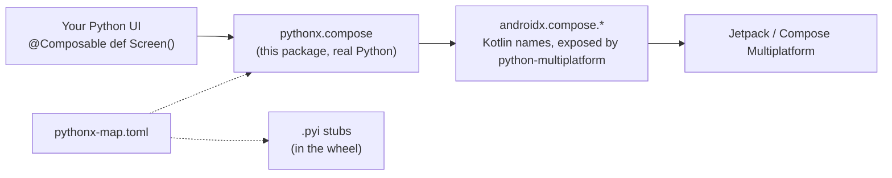

English | [한국어](https://github.com/thisisthepy/pythonx-compose/blob/main/docs/locale/README_ko.md)

<div align="center">

# pythonx-compose

**Write Compose user interfaces in Python — with Compose's own widgets, spelled the Python way.**

[](https://github.com/thisisthepy/pythonx-compose/blob/main/LICENSE)
[](https://github.com/thisisthepy/pythonx-compose/blob/main/pyproject.toml)
[](https://github.com/thisisthepy/pythonx-compose/blob/main/pyproject.toml)
[](#-status)

[Guide](https://thisisthepy.github.io/pythonx-compose/) · [Getting started](https://thisisthepy.github.io/pythonx-compose/getting-started.html) · [Concepts](https://thisisthepy.github.io/pythonx-compose/concepts.html) · [Status](https://thisisthepy.github.io/pythonx-compose/status.html)

</div>

---

## Why

Jetpack Compose and Compose Multiplatform are a superb way to build UI — if you write Kotlin.
`pythonx-compose` is for people who write Python. It does not reimplement Compose and it does not
invent a new widget set: it takes the real `androidx.compose.*` API, which
[python-multiplatform](https://github.com/thisisthepy/python-multiplatform) exposes to Python under
its Kotlin names, and restructures it into a Pythonic package, `pythonx.compose`.

```python
from pythonx.compose.runtime import Composable
from pythonx.compose.material3 import Text, Button

@Composable
def Greeting():
    Button(on_click=lambda: print("hi"), content=lambda: Text("Hello from Python"))
```

<sub>These names resolve today, by one rule, inside an app that embeds the binder; per-widget render
proofs are still pending. See [Status](#-status).</sub>

## ✨ Principles

- **The original API, Pythonic names.** Every parameter is Compose's own parameter, in
  `snake_case`: `onClick` → `on_click`, `horizontalAlignment` → `horizontal_alignment`. Upper-case
  names (types, objects, composables) keep their Kotlin spelling; every other name is `snake_case`
  only (`fillMaxWidth` → `fill_max_width`, `toURLString` → `to_url_string`), and an explicit
  overload keeps its suffix (`padding__Dp`).
- **Extension functions are methods.** `Modifier.padding(16).size(24).fill_max_width()` chains
  exactly as it does in Kotlin. Keyword arguments to such a method are `snake_case`
  too (`m.padding(padding_values=...)`), as they are on the module function
  `padding(m, padding_values=...)`; Kotlin's own spelling still works at run time, and the type
  stubs offer only the Pythonic one.
- **Kotlin objects are namespaces.** `Alignment.Center` and `Arrangement.End` are read without
  parentheses; functions inside them are `snake_case`: `Arrangement.spaced_by(8)`. Constants can
  also be reached grouped by their declared type, as the notebook writes them:
  `Alignment.Horizontal.End` is `Alignment.End`.
- **`@Composable` stays.** Screens are decorated Python functions.
- **A real package.** `pythonx/` is ordinary Python source that imports `androidx.compose.*` and
  reshapes it. The binder never renames anything — renaming is this package's job.
- **One manifest.** [`pythonx-map.toml`](https://github.com/thisisthepy/pythonx-compose/blob/main/pythonx/compose/pythonx-map.toml) says which `pythonx.compose.*` module
  stands for which Kotlin package. It lives inside the package and ships in the wheel. The runtime
  and the `.pyi` generator read the same file, so what your editor completes is what the interpreter
  resolves.

## 🧩 Architecture at a glance



| Python module | Kotlin package |
|---|---|
| `pythonx.compose.runtime` | `androidx.compose.runtime` |
| `pythonx.compose.ui` | `androidx.compose.ui` |
| `pythonx.compose.layout` | `androidx.compose.foundation.layout` |
| `pythonx.compose.material3` | `androidx.compose.material3` |

Each module is a real file whose `__init__.py` calls one re-export rule; names resolve on first use.
`Column`, `Row` and `Spacer` are importable from `pythonx.compose.material3` as well as
`pythonx.compose.layout`, as the notebook writes them (the manifest's `[aliases]`).

## 🚀 Quick start

> [!NOTE]
> `pythonx-compose` is an **alpha**. `0.1.0a1` is on [PyPI](https://pypi.org/project/pythonx-compose/);
> as a pre-release it installs with `pip install --pre pythonx-compose`.

From a clone, to run the tests:

```bash
git clone https://github.com/thisisthepy/pythonx-compose
cd pythonx-compose
python3 -m pip install pytest      # inside a virtual environment
python3 -m pytest tests -q
```

What runs today, from the repository root:

```python
from pythonx.compose.runtime import Composable

@Composable                      # an identity decorator: the function stays a plain function
def Screen():
    """A screen."""
    return "drawn"

assert Screen() == "drawn" and Screen.__name__ == "Screen"
```

```python
import tomllib                   # the manifest: the one place the mapping is written down

with open("pythonx/compose/pythonx-map.toml", "rb") as f:
    manifest = tomllib.load(f)

manifest["modules"]["pythonx.compose.layout"]
# 'androidx.compose.foundation.layout'
manifest["value-classes"]["raw-primitive-allowed"]
# ['androidx.compose.ui.unit.Dp']   ->  padding(16) means padding(16.dp)
```

```python
from pythonx.compose._reexport import python_name   # the naming rule, no binder needed

python_name("fillMaxWidth")   # 'fill_max_width'
python_name("toURLString")    # 'to_url_string'
python_name("Modifier")       # 'Modifier'
```

Reading a Compose name such as `pythonx.compose.material3.Text` needs the binder, which the Kotlin
host installs; outside an app it raises a `RuntimeError` saying so.

The tests that drive a `Modifier` chain and overload dispatch read the binder's adaptation layer
from a sibling [python-multiplatform](https://github.com/thisisthepy/python-multiplatform) checkout
(or `PYTHONMULTIPLATFORM_HOME`); without one they are skipped.

## 📦 Installation

Distributed as the pip package **`pythonx-compose`** (Python 3.11 or later), providing the import
package `pythonx.compose`, with the manifest inside the wheel, and typed: `.pyi` stubs generated from
real Compose 1.11.1 and `py.typed` ship with it. It runs inside an app that embeds CPython
through [python-multiplatform](https://github.com/thisisthepy/python-multiplatform); it is not a
standalone desktop toolkit.

## 🧪 Status

| Area | State |
|---|---|
| Mapping manifest `pythonx-map.toml` | ✅ implemented and tested |
| `@Composable` decorator | ✅ implemented and tested |
| `pythonx` as a real on-disk package re-exporting `androidx.compose.*` by one rule | ✅ implemented and tested |
| `Modifier` chains with snake_case methods, overload dispatch, `Dp` as a number | ✅ implemented and tested against the binder's layer |
| `Column`, `Row`, `Spacer` from `material3` as well as `layout` | ✅ implemented and tested |
| Method keyword arguments in `snake_case` | ✅ implemented and tested — module functions and methods (methods need python-multiplatform's `describe_member`) |
| The empty `Modifier` | 🟡 partial — `Modifier.padding(16)` from the class needs an app-supplied factory against real Compose |
| `Alignment` / `Arrangement` | ✅ implemented and tested — `Alignment.Center`, `Arrangement.spaced_by(8)`, and grouped `Alignment.Horizontal.End` beside `Alignment.End` |
| Material 3 widgets (`Text`, `Button`, `Card`, `TextField`, …) | 🟡 partial — re-exported by rule; render proofs per widget pending (#9) |
| Type stubs (`.pyi`) from real Compose 1.11.1, `py.typed` | ✅ implemented and checked with mypy; many types are still `Any` (#12) |
| Distribution (`pythonx-compose`) | 🟡 partial — the wheel carries the manifest, the re-export rule, the stubs and `py.typed` |
| Declared app root (`@app`) and Pythonic state (`state`), no update call | 🟡 partial — binder path tested against a fake host shaped after python-multiplatform #38; real Compose is the E2E module (#11, #19); numbers and strings round-trip through `state` |
| `TextField(state=...)` with `TextFieldState` (`pythonx.compose.foundation.text.input`) | 🟡 partial — tested against a fake host shaped after python-multiplatform #73; the input-method (IME) composing proof is python-multiplatform E2E #26 (#10) |
| `DefaultIcons` (`Icons.Default`), written `DefaultIcons.Add` | 🟡 partial — tested against a fake host shaped after python-multiplatform #37/#38; `Icon(DefaultIcons.Add, …)` is drawn in python-multiplatform's render test |
| Colour schemes | ⏳ planned |
| `remember_saveable`, coroutine scopes | ⏳ planned |

The full list is on the guide's [Status page](https://thisisthepy.github.io/pythonx-compose/status.html).

## 📖 Documentation

- **Guide** — [`docs/guide/`](https://thisisthepy.github.io/pythonx-compose/), bilingual (English / 한국어)
- **Korean README** — [`docs/locale/README_ko.md`](https://github.com/thisisthepy/pythonx-compose/blob/main/docs/locale/README_ko.md)

## 🔌 Ecosystem

| Repository | Role |
|---|---|
| [python-multiplatform](https://github.com/thisisthepy/python-multiplatform) | The binder: CPython embedded in Kotlin Multiplatform, exposing Kotlin to Python under Kotlin names |
| **pythonx-compose** | Compose, restructured for Python — this repository |
| [toolchain](https://github.com/thisisthepy/toolchain) | Gradle build plugin for Python Multiplatform apps |
| [pypackpack](https://github.com/thisisthepy/pypackpack) | Distributing Python projects across platforms |
| [torchnative](https://github.com/thisisthepy/torchnative) | Run the real PyTorch ecosystem on device |
| [Gemstone](https://github.com/LogitAI/Gemstone) | A Kotlin Multiplatform AI app built alongside the stack |

## 🤝 Contributing

Development is intent-first and test-first: a change starts as a specification change, then a
failing test, then code. The [guide](https://thisisthepy.github.io/pythonx-compose/status.html) lists what is open and where help is
useful. Please open an issue before large changes.

## Maintainers

| Name | Area | Since |
|---|---|---|
| [@b-re-w](https://github.com/b-re-w) | Composable runtime | 2023 |
| [@rnoro5122](https://github.com/rnoro5122) | Material 3 | 2024 |

## License

[MIT](https://github.com/thisisthepy/pythonx-compose/blob/main/LICENSE) © 2023–2024 BREW (b-re-w), Jong-uk Lee (rnoro5122)
