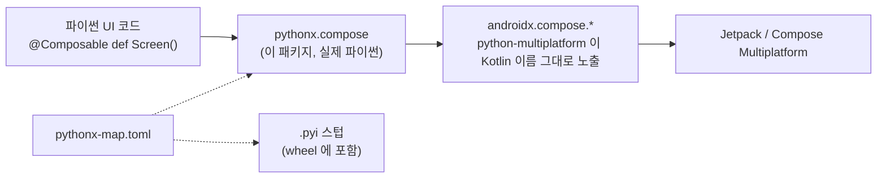

[English](https://github.com/thisisthepy/pythonx-compose/blob/main/README.md) | 한국어

<div align="center">

# pythonx-compose

**파이썬으로 Compose Multiplatform UI 를 만듭니다: 파이썬 선언형 UI 프레임워크**

[](https://github.com/thisisthepy/pythonx-compose/blob/main/LICENSE)
[](https://github.com/thisisthepy/pythonx-compose/blob/main/pyproject.toml)
[](https://github.com/thisisthepy/pythonx-compose/blob/main/pyproject.toml)
[](#-현황)

[가이드](https://thisisthepy.github.io/pythonx-compose/) · [시작하기](https://thisisthepy.github.io/pythonx-compose/getting-started.html) · [개념](https://thisisthepy.github.io/pythonx-compose/concepts.html) · [현황](https://thisisthepy.github.io/pythonx-compose/status.html)

</div>

---

## 왜 만드는가

Jetpack Compose 와 Compose Multiplatform 은 UI 를 만드는 훌륭한 방법입니다. Kotlin 을 쓴다면요.
`pythonx-compose` 는 파이썬을 쓰는 사람을 위한 것입니다. Compose 를 다시 구현하지도, 새 위젯 세트를
만들지도 않습니다. [python-multiplatform](https://github.com/thisisthepy/python-multiplatform) 이
Kotlin 이름 그대로 파이썬에 노출한 실제 `androidx.compose.*` API 를 가져와, 파이썬다운 패키지
`pythonx.compose` 로 재구성합니다.

```python
from pythonx.compose.runtime import Composable
from pythonx.compose.material3 import Text, Button

@Composable
def Greeting():
    Button(on_click=lambda: print("hi"), content=lambda: Text("Hello from Python"))
```

<sub>이 이름들은 바인더를 임베딩한 앱 안에서 지금 규칙 하나로 해석됩니다. 위젯별 렌더링 증거는 아직
대기 중입니다. [현황](#-현황)을 보세요.</sub>

## ✨ 원칙

- **원래 API, 파이썬다운 이름.** 모든 매개변수는 Compose 자신의 매개변수이고, 이름만 `snake_case`
  입니다: `onClick` → `on_click`, `horizontalAlignment` → `horizontal_alignment`. 대문자로 시작하는
  이름(타입, 객체, 컴포저블)은 Kotlin 표기를 유지하고, 그 밖의 이름은 `snake_case` 로만 접근하며
  (`fillMaxWidth` → `fill_max_width`, `toURLString` → `to_url_string`), 명시적 오버로드는 접미사를
  유지합니다(`padding__Dp`).
- **확장 함수는 메서드.** `Modifier.padding(16).size(24).fill_max_width()` 가 Kotlin 에서와 똑같이
  체이닝됩니다. 이런 메서드의 키워드 인자도 `snake_case` 이며(`m.padding(padding_values=...)`),
  모듈 함수 `padding(m, padding_values=...)` 와 같습니다. Kotlin 이름도 실행 시에는 그대로 통하지만
  타입 스텁은 Pythonic 이름만 제시합니다.
- **Kotlin 객체는 네임스페이스.** `Alignment.Center`, `Arrangement.End` 는 괄호 없이 읽고, 그 안의
  함수는 `snake_case` 입니다: `Arrangement.spaced_by(8)`. 노트북처럼 선언된 타입별로 묶어서 읽을
  수도 있습니다: `Alignment.Horizontal.End` 는 `Alignment.End` 입니다.
- **`@Composable` 은 그대로.** 화면은 데코레이터가 붙은 파이썬 함수입니다.
- **실제 패키지.** `pythonx/` 는 `androidx.compose.*` 를 import 해 재구성하는 평범한 파이썬
  소스입니다. 바인더는 아무 이름도 바꾸지 않습니다. 이름을 바꾸는 것은 이 패키지의 일입니다.
- **하나의 매니페스트.** [`pythonx-map.toml`](https://github.com/thisisthepy/pythonx-compose/blob/main/pythonx/compose/pythonx-map.toml) 이 어떤 `pythonx.compose.*`
  모듈이 어떤 Kotlin 패키지에 대응하는지 적습니다. 이 파일은 패키지 안에 있으며 wheel 에 함께
  담깁니다. 런타임과 `.pyi` 생성기가 같은 파일을 읽으므로, 편집기가 자동완성하는 이름과 인터프리터가
  해석하는 이름이 어긋나지 않습니다.

## 🧩 한눈에 보는 구조



| 파이썬 모듈 | Kotlin 패키지 |
|---|---|
| `pythonx.compose.runtime` | `androidx.compose.runtime` |
| `pythonx.compose.ui` | `androidx.compose.ui` |
| `pythonx.compose.layout` | `androidx.compose.foundation.layout` |
| `pythonx.compose.material3` | `androidx.compose.material3` |

각 모듈은 재노출 규칙 하나를 부르는 `__init__.py` 를 가진 실제 파일이며, 이름은 처음 쓸 때
해석됩니다. `Column`, `Row`, `Spacer` 는 노트북이 쓰는 대로 `pythonx.compose.layout` 뿐 아니라
`pythonx.compose.material3` 에서도 import 됩니다(매니페스트의 `[aliases]`).

## 🚀 빠른 시작

> [!NOTE]
> `pythonx-compose` 는 **알파** 단계입니다. `0.1.0a1` 이 [PyPI](https://pypi.org/project/pythonx-compose/) 에
> 있으며, 프리릴리스이므로 uv(또는 ppp, tcl)로 설치합니다.

```bash
uv add --prerelease allow pythonx-compose
# 또는 pypackpack 으로, ppp 워크스페이스의 패키지에 추가:
ppp core add "pythonx-compose==0.1.0a1"
# 또는 toolchain-lite 로:
tcl install pythonx-compose
```

클론에서 테스트를 돌리려면:

```bash
git clone https://github.com/thisisthepy/pythonx-compose
cd pythonx-compose
uv run --with pytest --with mypy pytest tests -q
```

저장소 루트에서 지금 동작하는 것:

```python
from pythonx.compose.runtime import Composable

@Composable                      # 항등 데코레이터: 함수는 평범한 함수 그대로 남는다
def Screen():
    """A screen."""
    return "drawn"

assert Screen() == "drawn" and Screen.__name__ == "Screen"
```

```python
import tomllib                   # 매니페스트: 대응 관계가 적힌 유일한 곳

with open("pythonx/compose/pythonx-map.toml", "rb") as f:
    manifest = tomllib.load(f)

manifest["modules"]["pythonx.compose.layout"]
# 'androidx.compose.foundation.layout'
manifest["value-classes"]["raw-primitive-allowed"]
# ['androidx.compose.ui.unit.Dp']   ->  padding(16) 은 padding(16.dp) 를 뜻한다
```

```python
from pythonx.compose._reexport import python_name   # 이름 규칙, 바인더 없이 동작

python_name("fillMaxWidth")   # 'fill_max_width'
python_name("toURLString")    # 'to_url_string'
python_name("Modifier")       # 'Modifier'
```

`pythonx.compose.material3.Text` 같은 Compose 이름을 읽으려면 Kotlin 호스트가 설치하는 바인더가
필요합니다. 앱 밖에서는 그 사실을 알려 주는 `RuntimeError` 가 납니다.

`Modifier` 체인과 오버로드 디스패치를 검사하는 테스트는 바인더의 적응 계층을 옆에 있는
[python-multiplatform](https://github.com/thisisthepy/python-multiplatform) 체크아웃(또는
`PYTHONMULTIPLATFORM_HOME`)에서 읽습니다. 없으면 건너뜁니다.

## 📦 설치

pip 패키지 **`pythonx-compose`**(파이썬 3.11 이상)로 배포되며, import 패키지 `pythonx.compose` 와
매니페스트를 wheel 안에 담으며, 타입 정보도 함께 배포합니다: 실제 Compose 1.11.1 에서 생성한 `.pyi`
스텁과 `py.typed`. [python-multiplatform](https://github.com/thisisthepy/python-multiplatform)
으로 CPython 을 임베딩한 앱 안에서 동작하며, 단독 데스크톱 툴킷이 아닙니다.

## 🧪 현황

| 영역 | 상태 |
|---|---|
| 매핑 매니페스트 `pythonx-map.toml` | ✅ 구현, 테스트됨 |
| `@Composable` 데코레이터 | ✅ 구현, 테스트됨 |
| `androidx.compose.*` 를 규칙 하나로 재노출하는 실제 디스크 패키지 `pythonx` | ✅ 구현, 테스트됨 |
| snake_case 메서드를 쓰는 `Modifier` 체인, 오버로드 디스패치, 숫자로 쓰는 `Dp` | ✅ 구현, 바인더 계층으로 테스트됨 |
| `layout` 뿐 아니라 `material3` 에서도 쓰는 `Column`, `Row`, `Spacer` | ✅ 구현, 테스트됨 |
| `snake_case` 메서드 키워드 인자 | ✅ 구현, 테스트됨: 모듈 함수와 메서드(메서드는 python-multiplatform 의 `describe_member` 필요) |
| 빈 `Modifier` | 🟡 부분: 클래스에서 시작하는 `Modifier.padding(16)` 은 실제 Compose 에서 앱이 제공하는 팩토리가 필요 |
| `Alignment` / `Arrangement` | ✅ 구현 및 테스트: `Alignment.Center`, `Arrangement.spaced_by(8)`, 그리고 `Alignment.End` 와 나란히 묶음 표기 `Alignment.Horizontal.End` |
| Material 3 위젯 (`Text`, `Button`, `Card`, `TextField`, …) | 🟡 부분: 규칙으로 재노출됨; 위젯별 렌더 증거 대기(#9) |
| 실제 Compose 1.11.1 에서 생성한 타입 스텁(`.pyi`), `py.typed` | ✅ 구현, mypy 로 검사; 아직 많은 타입이 `Any` 입니다(#12) |
| 배포 (`pythonx-compose`) | 🟡 부분: wheel 에 매니페스트, 재노출 규칙, 스텁, `py.typed` 포함 |
| 갱신 호출 없는 선언형 앱 루트(`@app`)와 파이썬다운 상태(`state`) | 🟡 부분: 바인더 경로는 python-multiplatform #38 모양의 가짜 호스트로 테스트됨, 실제 Compose 는 E2E 모듈(#11, #19), 숫자와 문자열은 `state` 로 왕복됨 |
| `TextField(state=...)` 와 `TextFieldState` (`pythonx.compose.foundation.text.input`) | 🟡 부분: python-multiplatform #73 모양의 가짜 호스트로 테스트됨; 입력기(IME) 조합 증거는 python-multiplatform E2E #26 (#10) |
| `DefaultIcons`(`Icons.Default`), `DefaultIcons.Add` 로 씀 | 🟡 부분: python-multiplatform #37/#38 모양의 가짜 호스트로 테스트됨; `Icon(DefaultIcons.Add, …)` 의 실제 그리기는 python-multiplatform 의 렌더 테스트에 있음 |
| 색 스킴 | ⏳ 계획 |
| `remember_saveable`, 코루틴 스코프 | ⏳ 계획 |

전체 목록은 가이드의 [현황 페이지](https://thisisthepy.github.io/pythonx-compose/status.html)에 있습니다.

## 📖 문서

- **가이드**: [`docs/guide/`](https://thisisthepy.github.io/pythonx-compose/), 영어 / 한국어
- **English README**: [`README.md`](https://github.com/thisisthepy/pythonx-compose/blob/main/README.md)

## 🔌 생태계

| 저장소 | 역할 |
|---|---|
| [python-multiplatform](https://github.com/thisisthepy/python-multiplatform) | 바인더: Kotlin Multiplatform 에 임베딩한 CPython, Kotlin 을 Kotlin 이름 그대로 파이썬에 노출 |
| **pythonx-compose** | 파이썬을 위해 재구성한 Compose (이 저장소) |
| [toolchain](https://github.com/thisisthepy/toolchain) | Python Multiplatform 앱을 위한 Gradle 빌드 플러그인 |
| [pypackpack](https://github.com/thisisthepy/pypackpack) | 파이썬 프로젝트의 멀티플랫폼 배포 |
| [torchnative](https://github.com/thisisthepy/torchnative) | 실제 PyTorch 생태계를 기기에서 실행 |
| [Gemstone](https://github.com/LogitAI/Gemstone) | 이 스택과 함께 만들어지는 Kotlin Multiplatform AI 앱 |

## 🤝 기여

개발은 의도 우선, 테스트 우선입니다: 변경은 스펙 변경으로 시작해, 실패하는 테스트를 거쳐, 코드로
끝납니다. 열린 항목과 도움이 필요한 곳은 [가이드](https://thisisthepy.github.io/pythonx-compose/status.html)에 있습니다. 큰 변경 전에는
이슈를 먼저 열어 주세요.

## 메인테이너

| 이름 | 영역 | 시작 |
|---|---|---|
| [@b-re-w](https://github.com/b-re-w) | Composable 런타임 | 2023 |
| [@rnoro5122](https://github.com/rnoro5122) | Material 3 | 2024 |

## 라이선스

[Apache License 2.0](https://github.com/thisisthepy/pythonx-compose/blob/main/LICENSE) © 2023–2024 BREW (b-re-w), Jong-uk Lee (rnoro5122)
