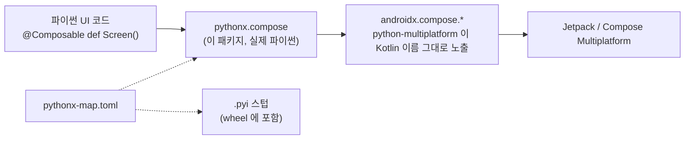

[English](../../README.md) | 한국어

<div align="center">

# pythonx-compose

**Compose UI 를 파이썬으로 — Compose 의 위젯 그대로, 파이썬다운 이름으로.**

[](../../LICENSE)
[](../../pyproject.toml)
[](../../pyproject.toml)
[](#-현황)

[가이드](../guide/index.html) · [시작하기](../guide/getting-started.html) · [개념](../guide/concepts.html) · [현황](../guide/status.html)

</div>

---

## 왜 만드는가

Jetpack Compose 와 Compose Multiplatform 은 UI 를 만드는 훌륭한 방법입니다 — Kotlin 을 쓴다면요.
`pythonx-compose` 는 파이썬을 쓰는 사람을 위한 것입니다. Compose 를 다시 구현하지도, 새 위젯 세트를
만들지도 않습니다. [python-multiplatform](https://github.com/thisisthepy/python-multiplatform) 이
Kotlin 이름 그대로 파이썬에 노출한 실제 `androidx.compose.*` API 를 가져와, 파이썬다운 패키지
`pythonx.compose` 로 재구성합니다.

```python
from pythonx.compose.runtime import Composable
from pythonx.compose.material3 import Text, Button

@Composable
def Greeting():
    Button(on_click=lambda: print("hi"), content=lambda: Text("Hello from Python"))
```

<sub>목표로 하는 사용 형태입니다. 지금 동작하는 범위는 [현황](#-현황)을 보세요.</sub>

## ✨ 원칙

- **원래 API, 파이썬다운 이름.** 모든 매개변수는 Compose 자신의 매개변수이고, 이름만 `snake_case`
  입니다: `onClick` → `on_click`, `horizontalAlignment` → `horizontal_alignment`.
- **확장 함수는 메서드.** `Modifier.padding(16).size(24)` 가 Kotlin 에서와 똑같이 체이닝됩니다.
- **`@Composable` 은 그대로.** 화면은 데코레이터가 붙은 파이썬 함수입니다.
- **실제 패키지.** `pythonx/` 는 `androidx.compose.*` 를 import 해 재구성하는 평범한 파이썬
  소스입니다. 바인더는 아무 이름도 바꾸지 않습니다 — 이름을 바꾸는 것은 이 패키지의 일입니다.
- **하나의 매니페스트.** [`pythonx-map.toml`](../../pythonx/compose/pythonx-map.toml) 이 어떤 `pythonx.compose.*`
  모듈이 어떤 Kotlin 패키지에 대응하는지 적습니다. 런타임과 `.pyi` 생성기가 같은 파일을 읽으므로,
  편집기가 자동완성하는 이름과 인터프리터가 해석하는 이름이 어긋나지 않습니다.

## 🧩 한눈에 보는 구조



| 파이썬 모듈 | Kotlin 패키지 |
|---|---|
| `pythonx.compose.runtime` | `androidx.compose.runtime` |
| `pythonx.compose.ui` | `androidx.compose.ui` |
| `pythonx.compose.layout` | `androidx.compose.foundation.layout` |
| `pythonx.compose.material3` | `androidx.compose.material3` |

## 🚀 빠른 시작

> [!NOTE]
> `pythonx-compose` 는 **pre-alpha** 단계이며 아직 PyPI 에 배포되지 않았습니다.

```bash
git clone https://github.com/thisisthepy/pythonx-compose
cd pythonx-compose
python3 -m pip install pytest      # 가상환경 안에서
python3 -m pytest tests -q
```

저장소 루트에서 지금 동작하는 것:

```python
from pythonx.compose.runtime import Composable

@Composable                      # 항등 데코레이터: 함수는 평범한 함수 그대로 남는다
def Screen():
    """A screen."""
    return "drawn"

assert Screen() == "drawn" and Screen.__name__ == "Screen"
```

```python
import tomllib                   # 매니페스트: 대응 관계가 적힌 유일한 곳

with open("pythonx/compose/pythonx-map.toml", "rb") as f:
    manifest = tomllib.load(f)

manifest["modules"]["pythonx.compose.layout"]
# 'androidx.compose.foundation.layout'
manifest["value-classes"]["raw-primitive-allowed"]
# ['androidx.compose.ui.unit.Dp']   ->  padding(16) 은 padding(16.dp) 를 뜻한다
```

`Modifier` 체인과 오버로드 디스패치를 검사하는 테스트는 바인더의 적응 계층을 옆에 있는
[python-multiplatform](https://github.com/thisisthepy/python-multiplatform) 체크아웃(또는
`PYTHONMULTIPLATFORM_HOME`)에서 읽습니다. 없으면 건너뜁니다.

## 📦 설치

pip 패키지 **`pythonx-compose`** 로 배포되며, import 패키지 `pythonx.compose` 와 `.pyi` 스텁을
wheel 안에 담습니다. [python-multiplatform](https://github.com/thisisthepy/python-multiplatform)
으로 CPython 을 임베딩한 앱 안에서 동작하며, 단독 데스크톱 툴킷이 아닙니다.

## 🧪 현황

| 영역 | 상태 |
|---|---|
| 매핑 매니페스트 `pythonx-map.toml` | ✅ 구현, 테스트됨 |
| `@Composable` 데코레이터 | ✅ 구현, 테스트됨 |
| 배포 메타데이터 (`pythonx-compose`) | 🟡 부분 — 설정됨; 스텁은 아직 생성 전, 매니페스트는 아직 패키지 밖 |
| `Modifier` 체인, 오버로드 디스패치, 숫자로 쓰는 `Dp` | 🟡 부분 — 바인더 계층으로 테스트; 런타임 쪽을 다시 잇는 동안 실패 중 |
| Material 3 위젯 (`Text`, `Button`, `Card`, `TextField`, …) | 🟡 부분 — python-multiplatform 에서 렌더링 증명, 이 패키지에서는 아직 재노출 전 |
| `androidx.compose.*` 를 import 하는 실제 디스크 패키지 `pythonx` | ⏳ 계획 |
| `remember_saveable`, `DefaultIcons`, 코루틴 스코프 | ⏳ 계획 |

전체 목록은 가이드의 [현황 페이지](../guide/status.html)에 있습니다.

## 📖 문서

- **가이드** — [`docs/guide/`](../guide/index.html), 영어 / 한국어
- **English README** — [`README.md`](../../README.md)

## 🔌 생태계

| 저장소 | 역할 |
|---|---|
| [python-multiplatform](https://github.com/thisisthepy/python-multiplatform) | 바인더: Kotlin Multiplatform 에 임베딩한 CPython, Kotlin 을 Kotlin 이름 그대로 파이썬에 노출 |
| **pythonx-compose** | 파이썬을 위해 재구성한 Compose — 이 저장소 |
| [toolchain](https://github.com/thisisthepy/toolchain) | Python Multiplatform 앱을 위한 Gradle 빌드 플러그인 |
| [pypackpack](https://github.com/thisisthepy/pypackpack) | 파이썬 프로젝트의 멀티플랫폼 배포 |
| [torchnative](https://github.com/thisisthepy/torchnative) | 실제 PyTorch 생태계를 기기에서 실행 |
| [Gemstone](https://github.com/LogitAI/Gemstone) | 이 스택과 함께 만들어지는 Kotlin Multiplatform AI 앱 |

## 🤝 기여

개발은 의도 우선, 테스트 우선입니다: 변경은 스펙 변경으로 시작해, 실패하는 테스트를 거쳐, 코드로
끝납니다. 열린 항목과 도움이 필요한 곳은 [가이드](../guide/status.html)에 있습니다. 큰 변경 전에는
이슈를 먼저 열어 주세요.

## 메인테이너

| 이름 | 영역 | 시작 |
|---|---|---|
| [@b-re-w](https://github.com/b-re-w) | Composable 런타임 | 2023 |
| [@rnoro5122](https://github.com/rnoro5122) | Material 3 | 2024 |

## 라이선스

[MIT](../../LICENSE) © 2023–2024 BREW (b-re-w), Jong-uk Lee (rnoro5122)
